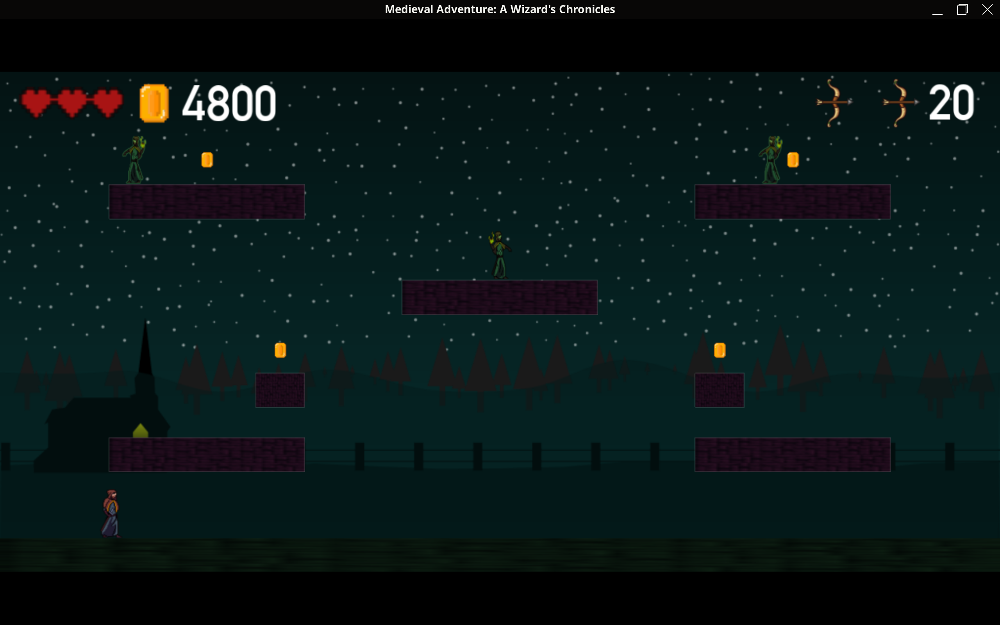

# Screenshot

# Description
This project is a simple platformer game, completed collaboratively by Basil Papadimas and Mario Matsas for credit in professor [Papaioannou](https://www.aueb.gr/en/faculty_page/papaioannou-georgios)'s C++ introductory course at [AUEB CS](https://www.dept.aueb.gr/en/cs) during the academic year 2023-2024. It depends on the [SGG graphics library](https://github.com/cgaueb/sgg), which was required to be used and was made specifically for this course.

Emphasis has been placed on code quality. We aspired to write performant code, so that even the most computationally intensive parts (such as the debug view, accessible by pressing 0) will have an acceptable framerate on modest hardware. We make frequent use of dynamic memory throughout, making sure to delete it after it's unneeded, so that the game can be played again and again without leaking memory (after the game's 4 levels have been completed, the user has the option to revert to the first level again, while also being able to reload a level if the player dies before finishing it).

Some highlights:
- SGG uses different units for the locations of mouse clicks and objects placed on the canvas (mouse clicks use real screen pixels, the objects on the canvas use a virtual grid of canvas pixels that stays the same after screen resizes) so we had to implement a mapping between these two (currently, this is actually one of the TODOs in the SGG project upstream). This is especially important for screen resizes (also supporting letterboxing!), because initially the two measurements are the same and resizes influence the mouse units (because they're tied to the real pixels).
- Arrows are rotated to face exactly parrallel to the line that connects their origin and their intended destination. This required trigonometry!
- Our classes are implemented to have a wide amount of (functional) parameters. Instead of being monolithic, there's many modular parts that can easily be adjusted, meaning the project could easily be extended (in fact, this software architecture was one of the reasons that made it very easy for us to work on this project). For instance, the Enemy objects have a "deciding function" pointer, which generates the commands based on which the enemies move (there is also a similar function that decides whether to attack, etc.). We have implemented two functions that we may initialize Enemy objects with, a function that doesn't move at all, and a function that tries to move in the direction of the Player. However, improving the "AI" of the enemies is as simple as pointing this field to a smarter function once it has been implemented, requiring no changes to the Enemy source code.

# Building (Linux)
You may need to download and build sgg for your CPU architecture. In that case, replace the precompiled aarch64 sgg files in lib/linux.
You will need these libraries:

    sudo dnf install glew glew-devel SDL2 SDL2_mixer SDL2-devel SDL2_mixer-devel freetype freetype-devel

In src/Config.h, make sure to point ASSET_PATH to the full path of the "assets" folder on your machine.

Then it's (hopefully) as simple as:

    cmake CMakeLists.txt
    make
    ./bin/game